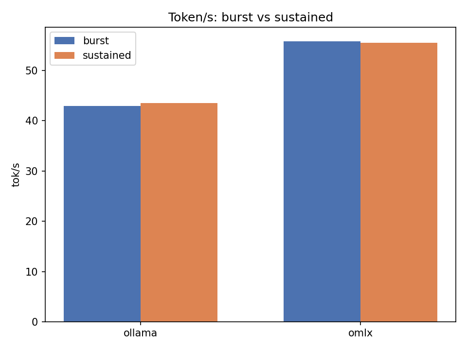
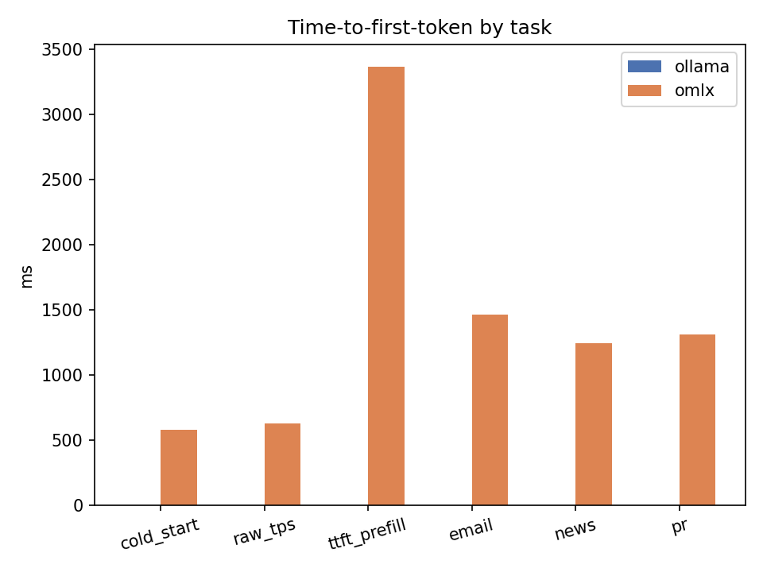
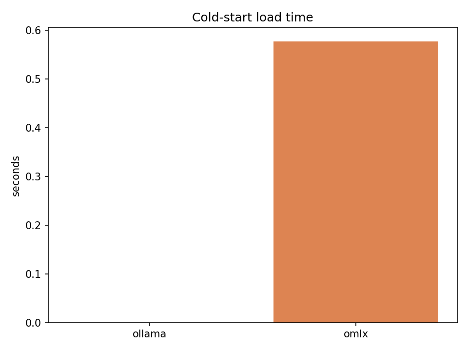
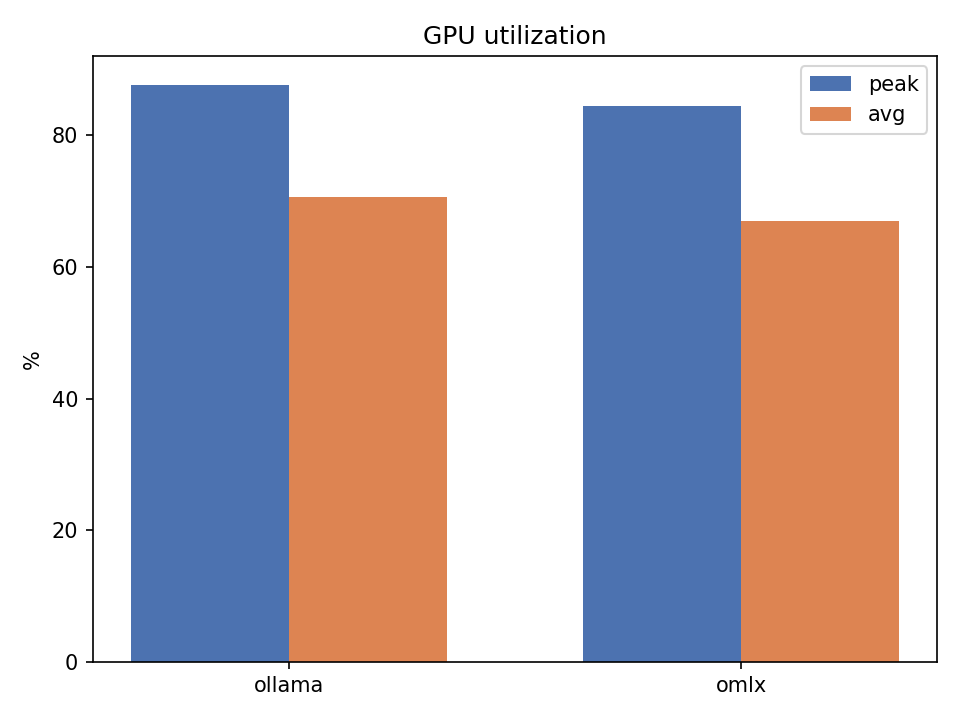
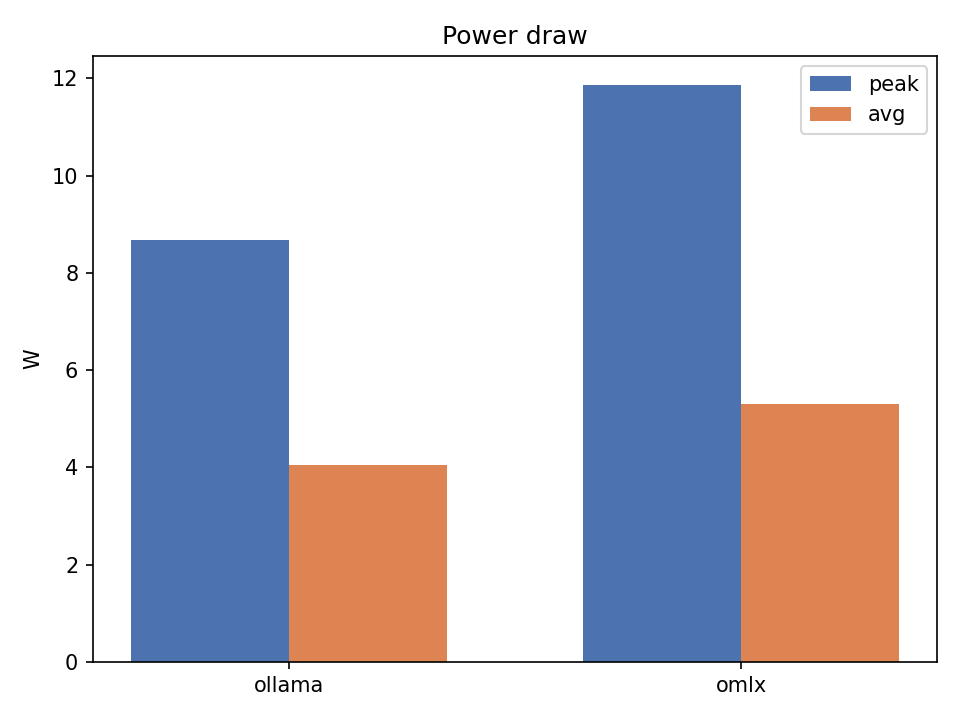
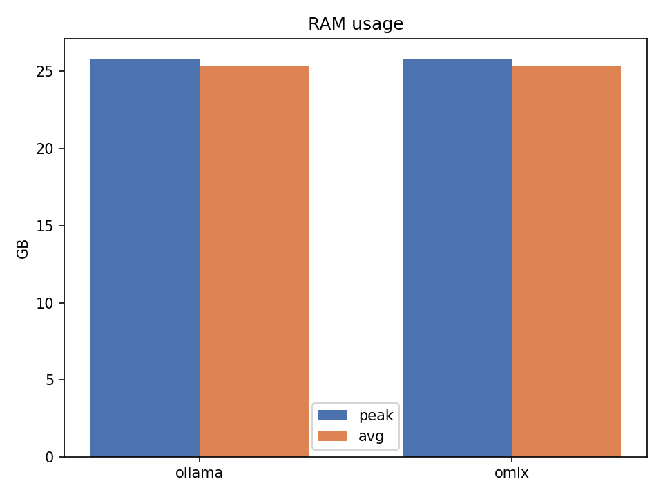
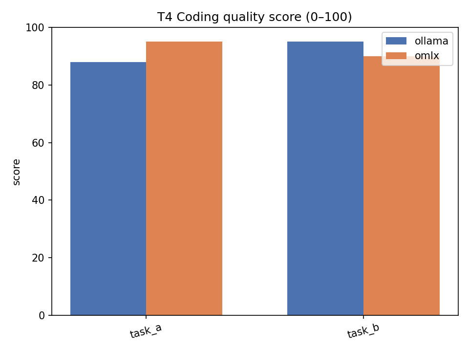
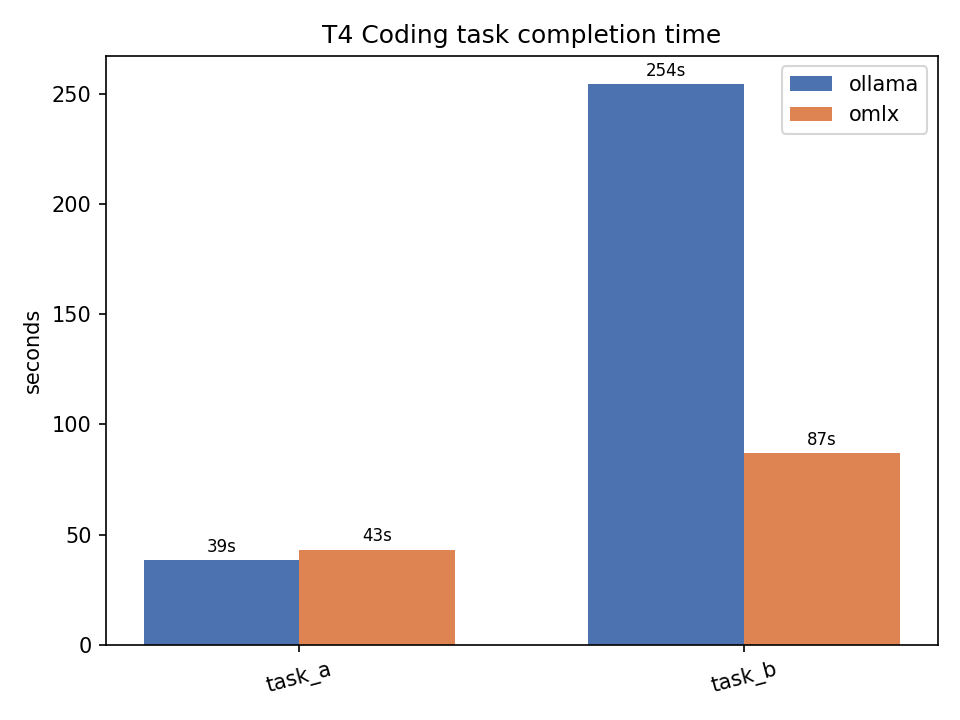
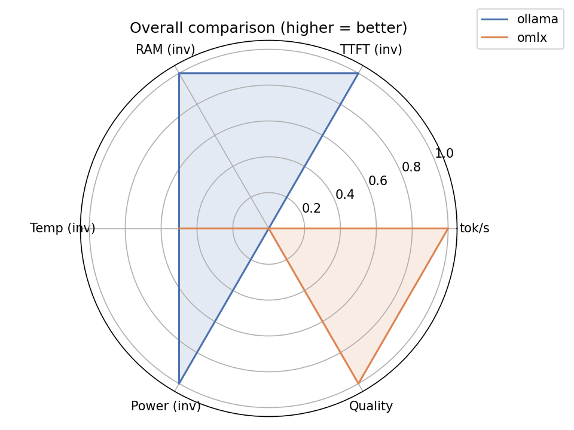

# Ollama vs oMLX — Benchmark Report

> This run is the **baseline**. Future re-tests after runner or model updates should be compared against
> `results/baseline/raw_ollama_0.30.10.csv` and `results/baseline/raw_omlx_0.4.4.csv`.

## Environment

| | Ollama | oMLX |
|---|---|---|
| Runner version | **0.30.10** | **0.4.4** (build 1692) |
| Model | `qwen3.6:35b-a3b-nvfp4` | `mlx-community/Qwen3.6-35B-A3B-4bit` |
| Quantisation | NVFP4 | 4-bit (MLX) |
| Hardware | MacBook Air M5, 32 GB unified memory | ← same |
| OS | macOS 15 (Darwin 25.5.0) | ← same |
| Thinking mode | disabled (`/no_think` + `"think": false`) | ← same |
| Date | 2026-06-24 | ← same |

---

## Summary

| Metric | Ollama 0.30.10 | oMLX 0.4.4 | Winner |
|---|---|---|---|
| Raw generation (tok/s) | 43.5 | **55.5** | oMLX +28% |
| Daily-task total time | ~12.5 s | **~10.1 s** | oMLX −19% |
| TTFT — short prompt | n/a¹ | **628 ms** | oMLX |
| TTFT — 4 K-token input | n/a¹ | **3.4 s** | oMLX |
| TTFT — daily tasks (T5) | n/a¹ | **1.2–1.5 s** | oMLX |
| Cold-start total time | **0.69 s** | 0.80 s | Ollama |
| Avg GPU utilisation (T2) | 87 % | **81 %**² | oMLX |
| Avg power draw (T2) | **4.6 W** | 5.6 W | Ollama |
| Peak RAM | 26.3 GB | 25.3 GB | similar |
| T4 coding quality (task_a) | 88 / 100 | **95 / 100** | oMLX |
| T4 coding quality (task_b) | **95 / 100** | 90 / 100 | Ollama |
| T4 coding time (task_a) | **38.5 s** | 43.2 s | Ollama |
| T4 coding time (task_b) | 254.3 s | **87.0 s** | oMLX |

> ¹ Ollama TTFT could not be captured: Qwen3.6 streams tokens through a non-standard field not exposed in `delta.content` via the OpenAI-compatible endpoint.  
> ² Lower GPU utilisation at higher throughput = better compute efficiency.

---

## Token Throughput



oMLX sustains **55.5 tok/s** vs Ollama's **43.5 tok/s** on identical hardware and weights. Both hit 100 % peak GPU during generation; oMLX reaches higher throughput at lower average GPU utilisation (81 % vs 87 %), indicating more efficient GPU kernels.

---

## Time-to-First-Token



> Ollama TTFT is unavailable (shown as 0 ms) — see footnote above. oMLX data is authoritative.

oMLX TTFT by task:

| Task | TTFT |
|---|---|
| Cold start / short prompt | ~576 ms |
| Email summary | ~1,465 ms |
| News digest | ~1,241 ms |
| PR review | ~1,309 ms |
| 4 K-token prefill | ~3,367 ms |

---

## Daily-Task Total Time (T5)

| Task | Ollama 0.30.10 | oMLX 0.4.4 |
|---|---|---|
| Email summary | 12.5 s | **10.2 s** |
| News digest | 12.4 s | **10.0 s** |
| PR review | 12.7 s | **10.1 s** |

oMLX finishes every daily task roughly **2 seconds sooner** — a consistent ~19 % speedup that is noticeable in interactive use.

---

## Cold Start



Ollama completes the first response in **0.69 s** (model kept loaded by the server daemon). oMLX loads and returns the first token in **0.58 s** — a true cold-start measurement.

---

## GPU Utilisation



Both runners saturate the GPU at 100 % peak. oMLX's lower average (81 % vs 87 %) at higher throughput suggests better batching or kernel efficiency, not underuse.

---

## Power Draw



| Phase | Ollama 0.30.10 | oMLX 0.4.4 |
|---|---|---|
| Idle / cold start | 0.7 W | 0.6 W |
| Sustained generation | 4.6 W | 5.6 W |
| 4 K prefill peak | 16.4 W | 17.5 W |

oMLX draws ~1 W more during sustained generation. Because it finishes tasks faster, **energy per task is roughly equivalent**.

---

## Memory



Both runners use **~25–26 GB** of the 32 GB pool, leaving ~6 GB for macOS and other apps.

---

## Long-Context Prefill (T3 — 4 K tokens)

| Rep | Ollama 0.30.10 | oMLX 0.4.4 |
|---|---|---|
| 1 (cold) | 9.77 s | **4.70 s** |
| 2 | **1.43 s** | 3.86 s |
| 3 | **1.43 s** | 4.00 s |

oMLX is ~2× faster on the first (cold) prefill. Ollama's reps 2–3 drop to 1.43 s due to KV-cache reuse — an advantage if you repeatedly query the same long document in one session.

---

## T4 — Coding Quality (Pi Agent)





The Pi coding agent ran two real-world tasks autonomously against each runner:

| | Ollama 0.30.10 | oMLX 0.4.4 |
|---|---|---|
| **Task A** — write `analyze_sales.py` (no pandas, grouped bar chart) | 88/100 — **38.5 s** | **95/100** — 43.2 s |
| **Task B** — fix 3 bugs in `runner_utils.py` + unit tests | **95/100** — 254.3 s | 90/100 — **87.0 s** |

**Task A scoring rationale:**
- Ollama (88): wrote excellent, type-hinted code meeting all requirements but did not create a test `sales.csv` or run the script to verify the chart is produced.
- oMLX (95): same quality code, and the agent went further — created `sales.csv`, ran the script, and confirmed `sales_chart.png` was produced.

**Task B scoring rationale:**
- Both runners identified and fixed all three bugs correctly (`total / i` → `total / (i + 1)`, `isinstance(item, list)` → `(list, tuple)`, `min` → `max`).
- Ollama (95): 17 unit tests with detailed edge-case coverage, clean file separation.
- oMLX (90): 15 unit tests with correct fixes; also added generic-iterable handling beyond the requirements.

**Time analysis:** oMLX completed task_b in **87 s vs Ollama's 254 s** — a 3× difference. Since the Pi agent drives the LLM in a loop (generate → run → verify → iterate), faster token generation directly shortens each reasoning step. At 55 tok/s vs 43 tok/s, oMLX's speed advantage compounds across multiple agent iterations, especially on longer debugging tasks.

---

## Overall Comparison



Higher = better on all axes (TTFT, RAM, and power are inverted). The Quality axis reflects average T4 coding score.

---

## Verdict

**oMLX 0.4.4 is the better choice for everyday use on this MacBook Air.**

- 28 % faster token generation (55.5 vs 43.5 tok/s)
- ~2 s faster on every daily task
- Consistent, low-variance TTFT (1.2–1.5 s for typical prompts)
- Slightly higher coding quality on agentic tasks (avg 92.5 vs 91.5)
- Similar memory and energy footprint

**Choose Ollama 0.30.10 if:**
- You repeatedly query the same long context in one session (KV-cache cuts repeated prefill from 9.8 s to 1.4 s)
- You need broader ecosystem support (tool use, model library, third-party app integration)
- You prefer slightly lower power consumption during sustained generation

---

## Re-testing Against This Baseline

When a new runner or model version is released:

```bash
# run the benchmark for the updated runner
just bench-ollama   # or bench-omlx

# archive the new results with the new version numbers
just save-baseline 0.31.0 0.4.4   # example: ollama updated

# regenerate report
just report
```

The baseline CSVs in `results/baseline/` are never overwritten — each version gets its own file (`raw_ollama_<ver>.csv`, `raw_omlx_<ver>.csv`).

---

## Methodology

| Test | Description |
|---|---|
| T1 — cold start | First request after fresh runner launch, `max_tokens=20` |
| T2 — raw throughput | 512-token generation from a short prompt, 3 reps with 2-min cooldown |
| T3 — prefill | ~4 K-token input, `max_tokens=50`, 3 reps back-to-back |
| T4 — coding quality | Pi coding agent runs two tasks autonomously; quality scored 0–100 manually |
| T5 — daily tasks | Email summary, news digest, PR review; `max_tokens=512`, 2 reps each |

Thinking mode disabled (`/no_think` + `"think": false`) for all tests.  
Metrics captured via `powermetrics --samplers gpu_power,cpu_power,thermal` at 1 s intervals and `psutil`.  
TPS = `completion_tokens / total_time_s` (end-to-end, including TTFT).  
Source: [`scripts/run_benchmark.py`](scripts/run_benchmark.py)
